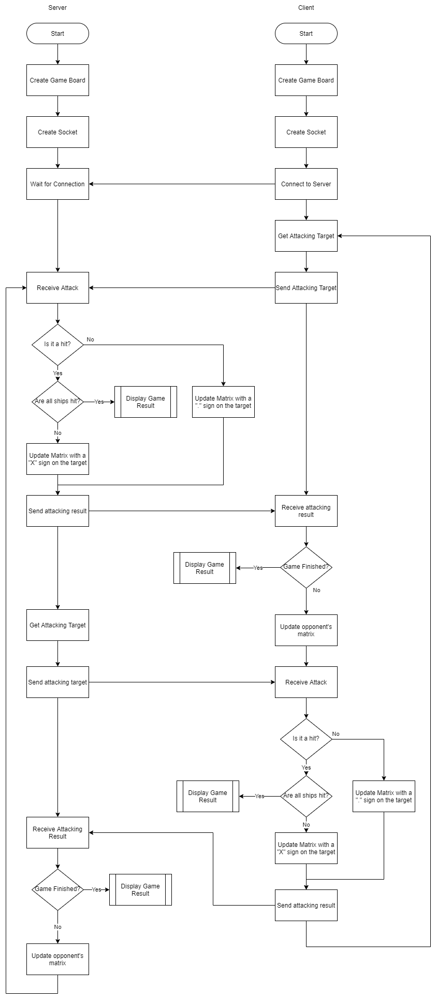

# T2A3 Multi-player Battle Ship Game in Python

This app will enable two people to play the battle ship game via socket connections.

## Feature

Users can select the game to be played with human players or with AI. 

With the AI option, the app will deploy the ships and select the hit target automatically. Currently the strategy is just deploy and hit at random. In the future when I learned machine learning this strategy can be upgraded. 

If played with a human player, the user will need to input the coordinate when deploying the ships and selecting the target to attack.

## Game Play

The app will display two 5x5 matrices, one for the player themselves and one for the opponent.

In the beginning, both sides deploy their ships. An example of a deployed matrix:

    O O O O O
    O H H O H
    O O O O H
    H H H O H
    O O O O H

'H' Represents the ships.

Two players take turns to attack. Player A first sends a coordinate to hit. (0, 0) represents the top left corner, and (4, 4) represents the right bottom corner.

Player B receives the coordinate, and it will calculate:
1. The attack is a miss or a hit?
2. If the game is over?

If the game is not over, player B will update its matrix, replace the hit position with a "." sign if it was a miss, or an "X" sign if it was a hit. An example of the matrix after several rounds of play:

    O O . . O
    O H X O H
    O O . O X
    H H H O X
    O . O O X

Player B then returns the hit result to the player A. So player A can know the game is over or not, and update their vision of the matrix accordingly. The above matrix at the opponent's view would be:

    O O . . O
    O O X O O
    O O . O X
    O O O O X
    O . O O X

Then it is player B's turn to attack.

## Structure of the solution

**Class:**

A Class of the Game_Board. It contains a 5x5 matrix with symbles representing the status of that cell.

**Class Methods:**

| Name          | Description |
|---------------|-------------|
| \_\_init\_\_  | Initialize the matrix
| deploy_ships  |Deploy three ships (1x2, 1x3, 1x4) on the board. Either at random or take input from users.
| check_hit     |Take the attacked coordinate, return it is a hit or a miss
| check_game    |Check if all the ships have been hit
| update_matrix |take the attacked coordinate and the attack result, update the matrix
| draw_board    |print the matrix

 

**Functions:**

|Name           |Description|
|---------------|-----------|
| user_input    |Take users' input on the target to attack
| send_attack   |Send the coordinate of attacking target
| attack_result |Receive the attacking result from the opponent
| end_game      |Display the result of the game    

## Flow Chart:

## Python Dependencies:

- Python standard libraries. (random)
- Socket